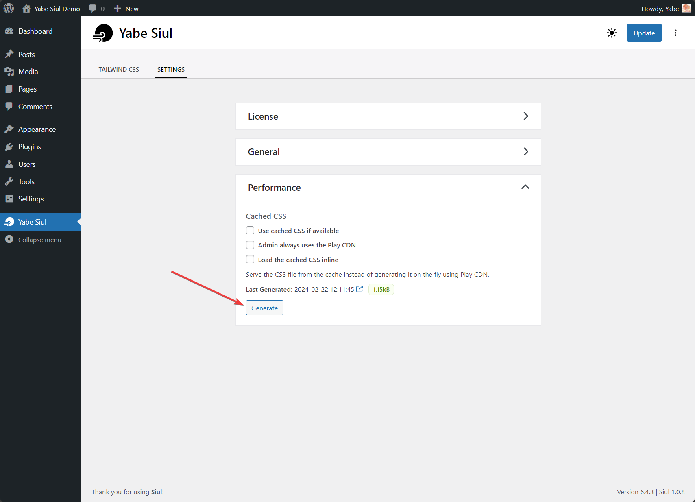
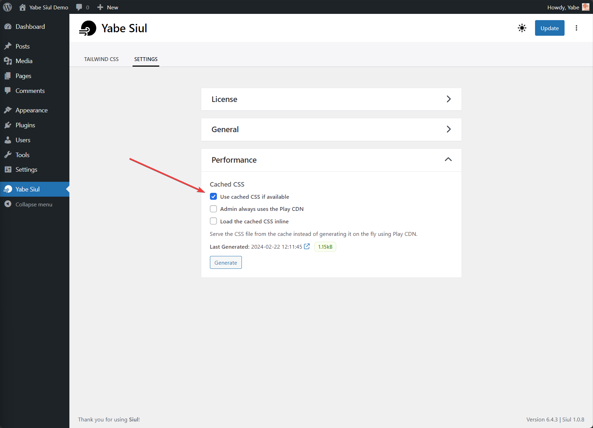

Tailwind CSS generates CSS based on the actual usage of the project, aiming to produce the smallest possible CSS file and improve performance. Even for large projects, when combined with minification, Tailwind CSS generate a single CSS file that's less than 10kB, which can be downloaded once and cached for all pages.

Yabe Siul uses a hybrid approach to integrate Tailwind CSS into WordPress.

During development, Yabe Siul uses the [Play CDN](https://tailwindcss.com/docs/installation/play-cdn) to dynamically create the required page styles. The Play CDN is designed for development purposes only, and is not the best choice for production.

For the most performance in the production environment, Yabe Siul will use engine running right on your browser to generate a tiny single cached CSS file. We use [Lightning CSS](https://lightningcss.dev/) to vendor prefix and minify CSS for the smallest possible build with wider browser support. None of your data is transferred over the network. Everything is done on your browser.

## Step 1: Generating the cached CSS file

To generate the cached CSS file, you can go to `Yabe Siul → Settings` and open the `Performance` panel. Then, click the `Generate` button.

## Step 2: Using the cached CSS file

Now that the cached CSS file is generated, you can start using it on the front end by ticking the `Use cached CSS if available` checkbox.

## Step 3: Save the changes
Save the changes and you are ready to get the best performance out of Tailwind CSS in WordPress.