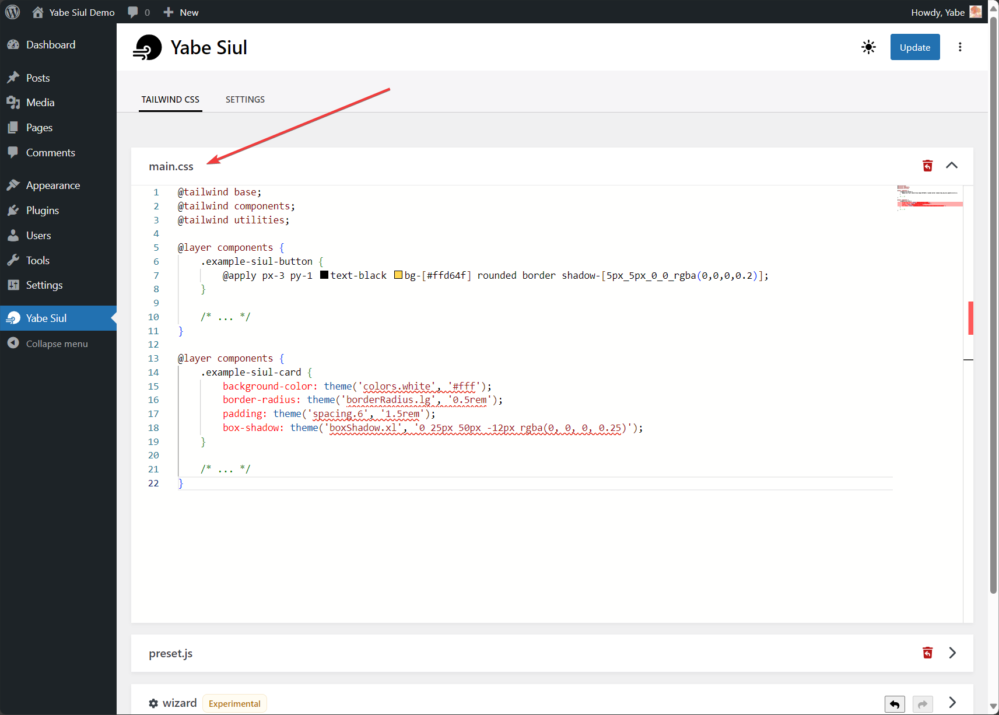

When you need to add truly custom CSS rules to the project, the easiest approach is to just add the custom CSS into the `main.css` file. It acts as the primary stylesheet reference for Tailwind CSS when it creates the styles.

To customize the `main.css` file, you can go to `Yabe Siul → Tailwind CSS` and open the `main.css` panel.

Tailwind CSS official documentation has covered this topic in-depth. Some of them are:

- https://tailwindcss.com/docs/adding-custom-styles#using-css-and-layer
- https://tailwindcss.com/docs/functions-and-directives
