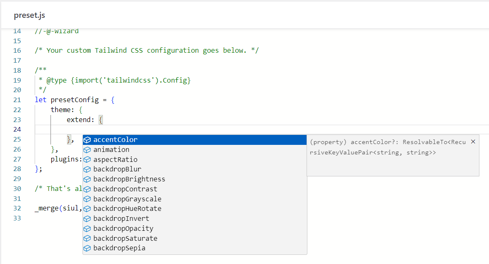

Tailwind CSS has been designed from the ground up to be extensible and customizable, making it easy to work with and ideal for any project.

Yabe Siul tries to preserve this customization flexibility when integrating the Tailwind CSS within the WordPress. This is achieved by utilizing the `preset.js` file to define the Tailwind CSS configuration.

To customize the `preset.js` file, you can go to `Yabe Siul → Tailwind CSS` and open the `preset.js` panel.


Tailwind CSS official documentation has covered this topic in-depth. Some of them are:

- https://tailwindcss.com/docs/configuration

## Understanding the `preset.js` file

The `preset.js` file is a JavaScript file that lets you define the Tailwind CSS configuration.

### The `siul` variable

The `siul` variable serves as the only container for the Tailwind CSS configuration. It is effectively standing in for the `module.exports` in the official Tailwind CSS documentation.

```javascript {6}
/**
 * The Tailwind CSS configuration required by the SIUL plugin.
 *
 * @type {import('tailwindcss').Config} 
 */
let siul = {};
```

The `preset.js` file must have the `siul` variable defined.

### Wizard placeholder

When you use the [Wizard](../wizard) to define customization, the generated configuration will be added to the `tailwind.config.js` file at the position marked by the `//-@-wizard` placeholder within the `preset.js` file.

```javascript {3}
/* The autogenerated Tailwind CSS configuration from the Wizard goes below. */

//-@-wizard
```

### Your custom configuration

The `presetConfig` variable is acted as the container for your custom configuration. It has the same structure as the `siul` variable.

```javascript {6-11}
/* Your custom Tailwind CSS configuration goes below. */

/**
 * @type {import('tailwindcss').Config} 
 */
let presetConfig = {
    theme: {
        extend: {},
    },
    plugins: [],
};

/* That's all, stop editing! Happy building. */
```

The `presetConfig` variable in the code editor has type hinting, which allows you to view the configuration structure and available options.



### Merging the configuration

In the end, the `presetConfig` variable will be merged into the `siul` variable.

```javascript {4}
/**
 * @type {import('lodash').merge}
 */
const _merge = require('lodash.merge');
```

It uses the `lodash.merge` JavaScript package to merge the `presetConfig` into the `siul` variable.

```javascript
_merge(siul, presetConfig);
```

## JavaScript package

This is made possible by the [esm.sh](https://esm.sh/), a modern CDN that allows you to import [ES6 modules](https://developer.mozilla.org/en-US/docs/Web/JavaScript/Guide/Modules) from a URL.

### `require()` syntax

Yabe Siul allow you to use the JavaScript package via [npm](https://www.npmjs.com/) within the `preset.js` file for additional functionality. You can use the `require()` syntax to include the JavaScript package. 
The pattern for using the JavaScript package is:

```javascript
const some_package = require('[package_name][@version][/path][?query]');
```

The `version`, `path`, and `query` are optional. If you don't specify a version, the latest version will be used.

Example:

```javascript
const lodash = require('lodash');

const throttle = require('lodash@4.17.21/throttle');
```

Even though it uses `require()` syntax that is typically used with CommonJS modules, it is not an actual CommonJS module. It is an alias for the `import()` syntax called [dynamic import](https://developer.mozilla.org/en-US/docs/Web/JavaScript/Guide/Modules#dynamic_module_loading) that is used to include a JavaScript ES6 module in modern JavaScript. 

### `import` syntax

You can also use the `import` syntax to include the JavaScript package from a URL.

```javascript
import lodash from 'https://esm.sh/lodash';

import throttle from 'https://esm.sh/lodash@4.17.21/throttle';
```

### Tailwind CSS plugins

Extending Tailwind CSS with reusable third-party plugins. Plugins allow you to expand Tailwind CSS' capabilities by adding new styles to the user's stylesheet via JavaScript, instead of CSS.

Yabe Siul supports the use of Tailwind CSS plugins within the `preset.js` file. You can use the `require()` syntax to include the Tailwind CSS plugin.

```javascript {8-11,13-15}
const plugin = require('tailwindcss/plugin');

let presetConfig = {
    theme: {
        extend: {},
    },
    plugins: [
        require('@tailwindcss/typography'),
        require('@tailwindcss/forms'),
        require('@tailwindcss/aspect-ratio'),
        require('@tailwindcss/container-queries'),

        plugin(function({ addUtilities, addComponents, e, config }) {
            // Add your custom styles here
        }),
    ],
};
```