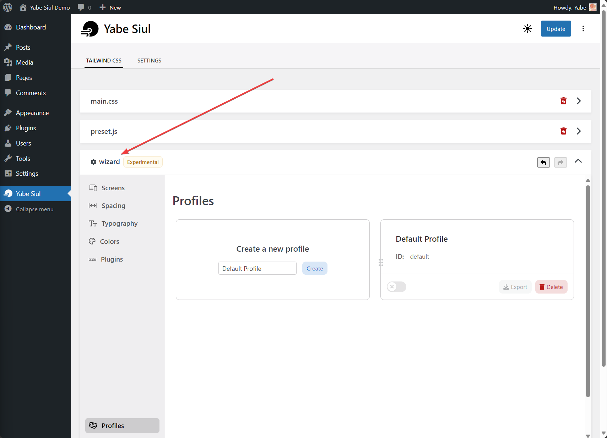

The Wizard is a tool that allows you to configure Tailwind CSS without having to write any code. It simplifies generating the Tailwind CSS configuration by providing a visual interface. The generated configuration can be easily added to the tailwind.config.js file by using the provided [placeholder](../preset-js/#wizard-placeholder).

The customization is contained within the [profile](./profile). You can create and switch between multiple profiles.

To access the Wizard, you can go to `Yabe Siul → Tailwind CSS` and open the <code><i class="fa-solid fa-gear paragraph"></i> wizard</code> panel.

## Components

The Wizard is divided into components representing different parts of Tailwind CSS configuration:

- [Screens](./screens)
- [Spacing](./spacing)
- [Typography](./typography)
- [Colors](./colors)
- [Plugins](./plugins)