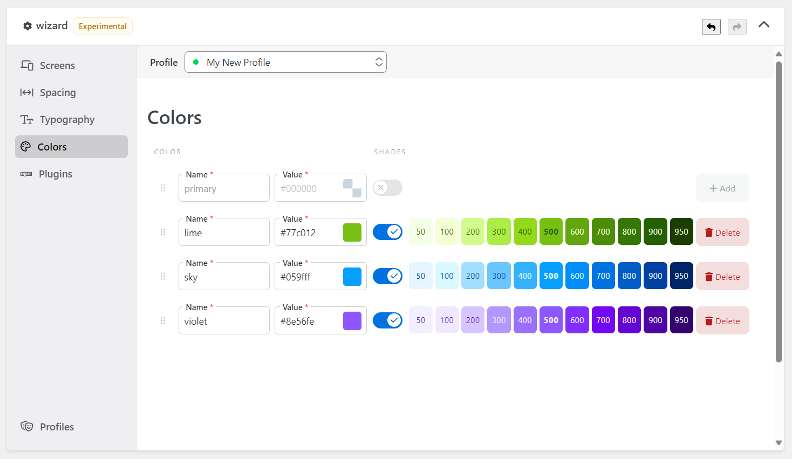

The [Wizard] Colors component allows you to manage the color palette of Tailwind CSS.

At the moment, the shades of the colors are not customizable and are generated automatically. This is a feature that will be addressed in the future.

Tailwind CSS official documentation has covered this topic in-depth. Some of them are:

- https://tailwindcss.com/docs/customizing-colors#using-custom-colors