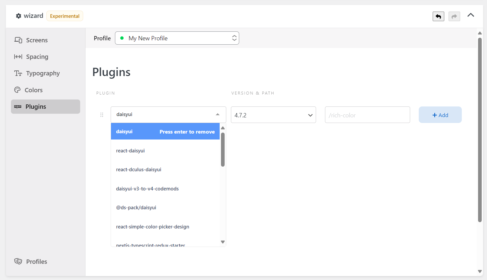

The [Wizard] Plugins component allows you to manage the plugin of Tailwind CSS.

Plugins let you register new styles for Tailwind to inject into the user's stylesheet using JavaScript instead of CSS.

To learn more about the plugin's support in Yabe Siul, please refer to [preset.js](../../preset-js/#tailwind-css-plugins) documentation.

Tailwind CSS official documentation has covered this topic in-depth. Some of them are:

- https://tailwindcss.com/docs/plugins