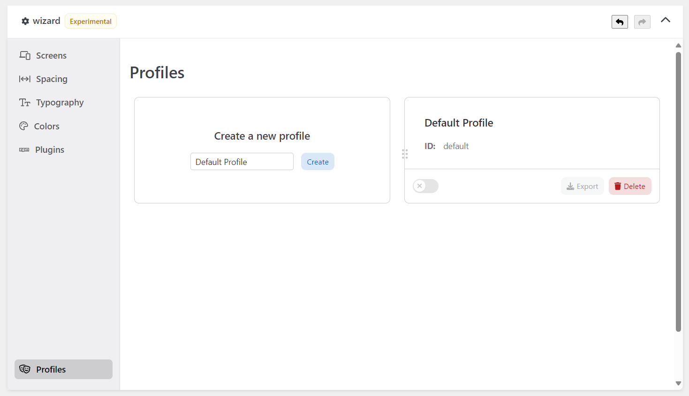
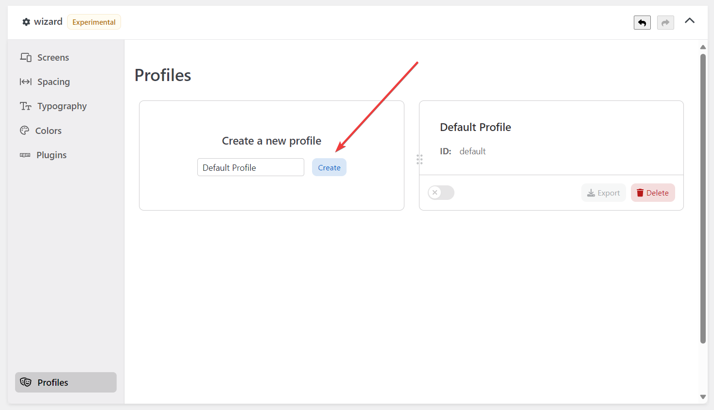
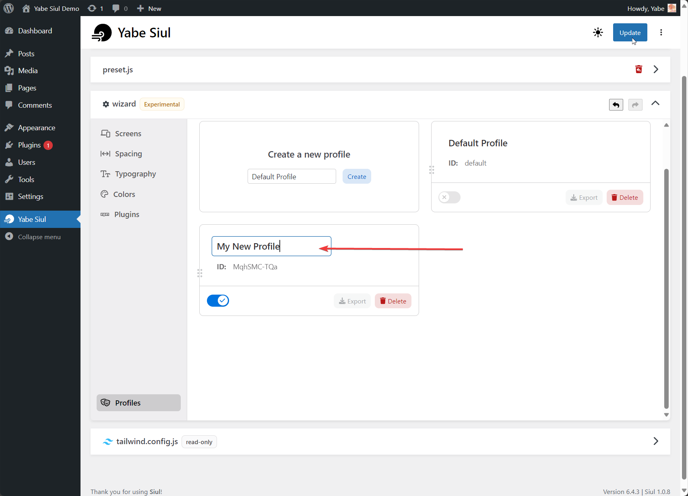
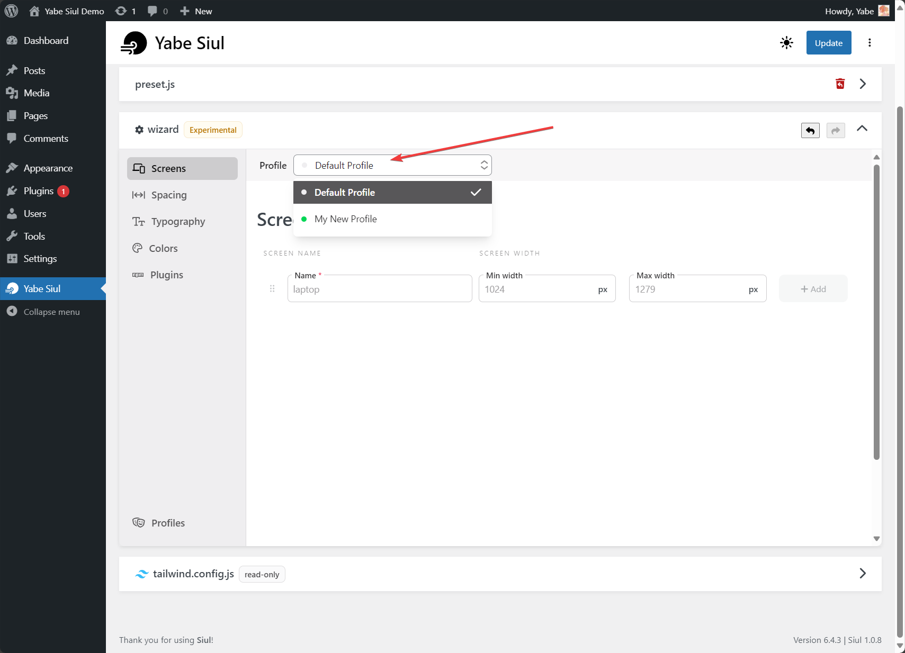

The Wizard Profile is a storage unit that holds the customizations of the Wizard. You can create and switch between multiple profiles. Each profile remains independent from the others, which means that you can enable or disable the customizations without affecting other profiles.

## Creating a profile

To create a new profile, add a name in the input field and click the `Create` button.

To rename a profile, click the label of the profile, and a text input will appear. Then, click the `Update` button on the top right of screen.

## Switching profiles

To switch between profiles, access the `Profile` dropdown and select the desired profile.

## Import and export

You can import and export profiles to share them with other users or to keep them as a backup. To do so, click the `Import` or `Export` button.