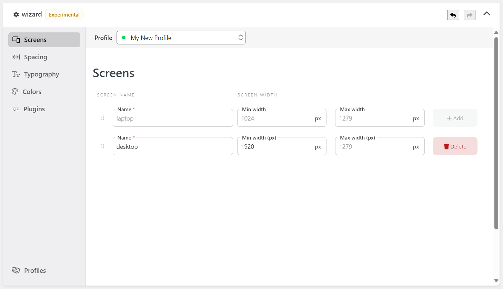

The [Wizard] Screens component allows you to manage the breakpoints of Tailwind CSS.

The `name` will be the key of your [responsive modifiers](https://tailwindcss.com/docs/responsive-design) (like `laptop:text-center`), and the `width` will be the value of the breakpoints range in pixels.

Tailwind CSS official documentation has covered this topic in-depth. Some of them are:

- https://tailwindcss.com/docs/screens
- https://tailwindcss.com/docs/responsive-design