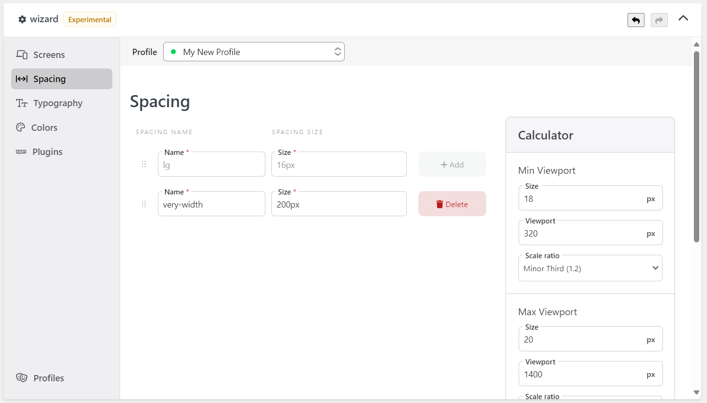
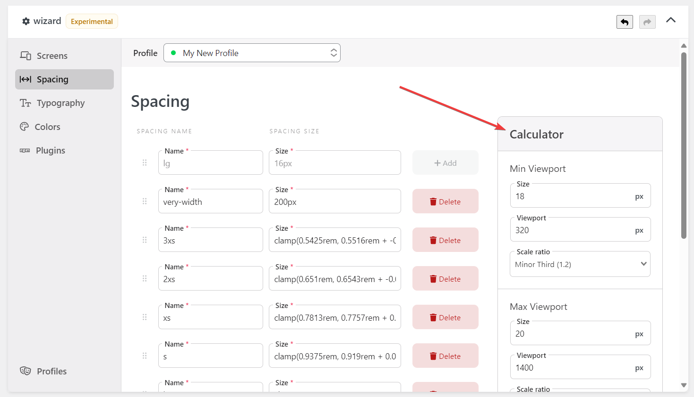

The [Wizard] Spacing component allows you to manage the spacing and sizing scale of Tailwind CSS.

The `name` will be the key of your spacing/sizing scale (like `p-lg` or `h-128`), and the `size` will be the value of the scale.

Tailwind CSS official documentation has covered this topic in-depth. Some of them are:

- https://tailwindcss.com/docs/customizing-spacing

## Fluid Spacing Scale

The Wizard has a calculator on the right side screen to generate a fluid spacing scale. The generated values use the `clamp` CSS function to create a fluid spacing scale.

