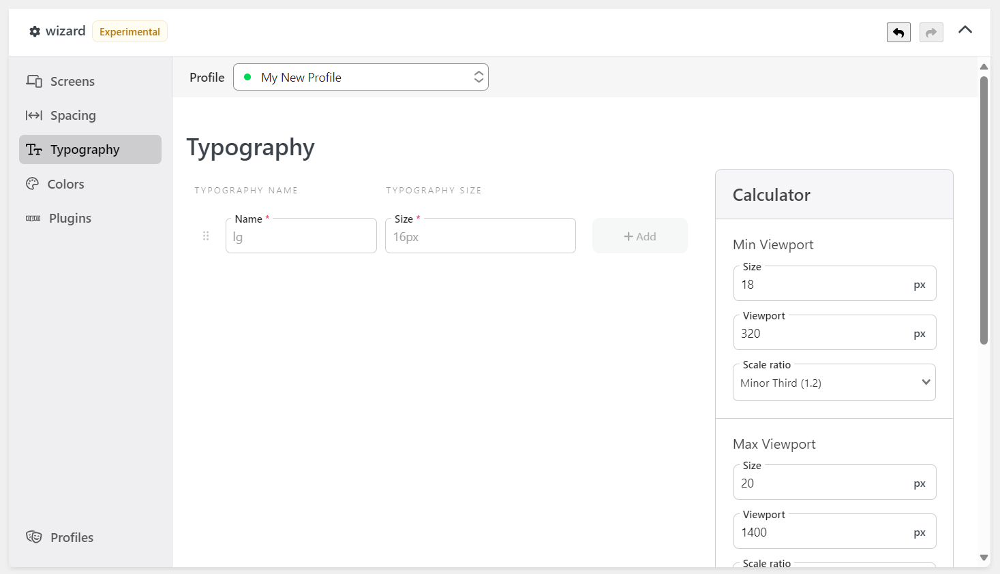
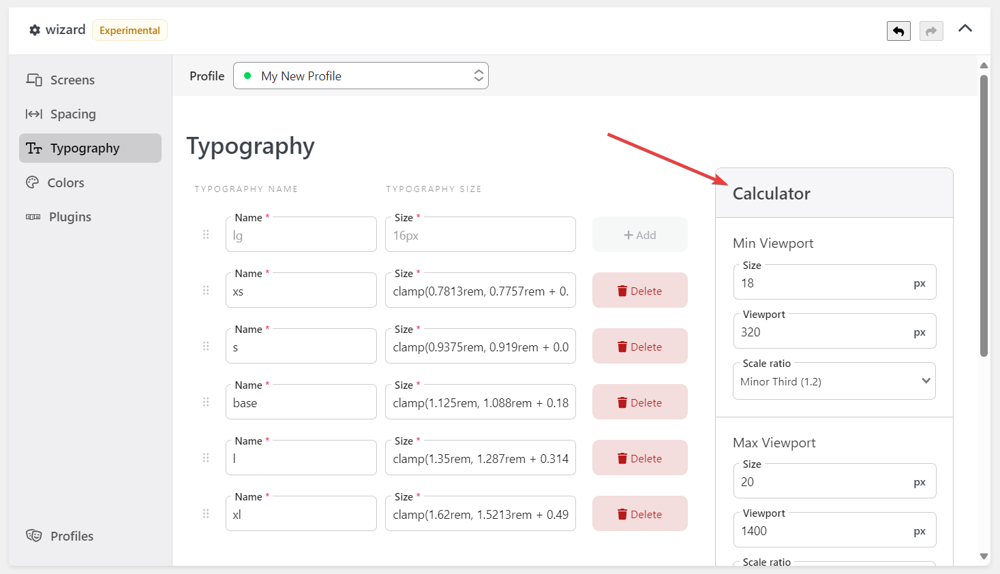

The [Wizard] Typography component allows you to manage the font size of Tailwind CSS.

The `name` will be the key of your font size (like `text-{key}`), and the `size` will be the value of the font size.

Tailwind CSS official documentation has covered this topic in-depth. Some of them are:

- https://tailwindcss.com/docs/font-size#customizing-your-theme

## Fluid Typography

The Wizard has a calculator on the right side screen to generate a fluid font size. The generated values use the `clamp` CSS function to create a fluid font size.

