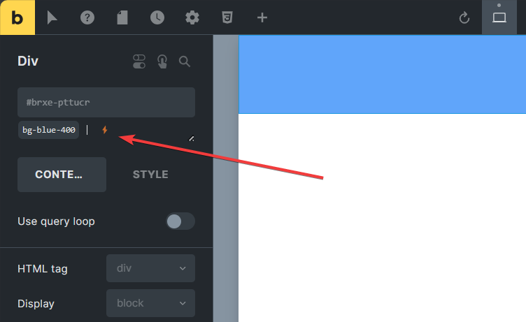
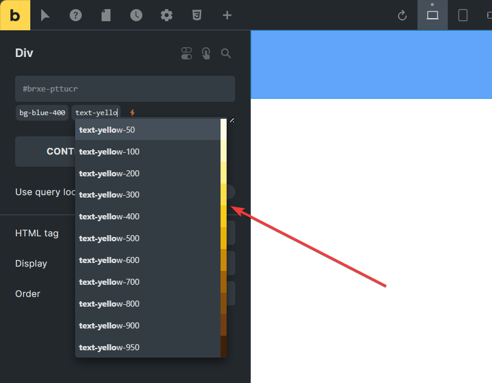
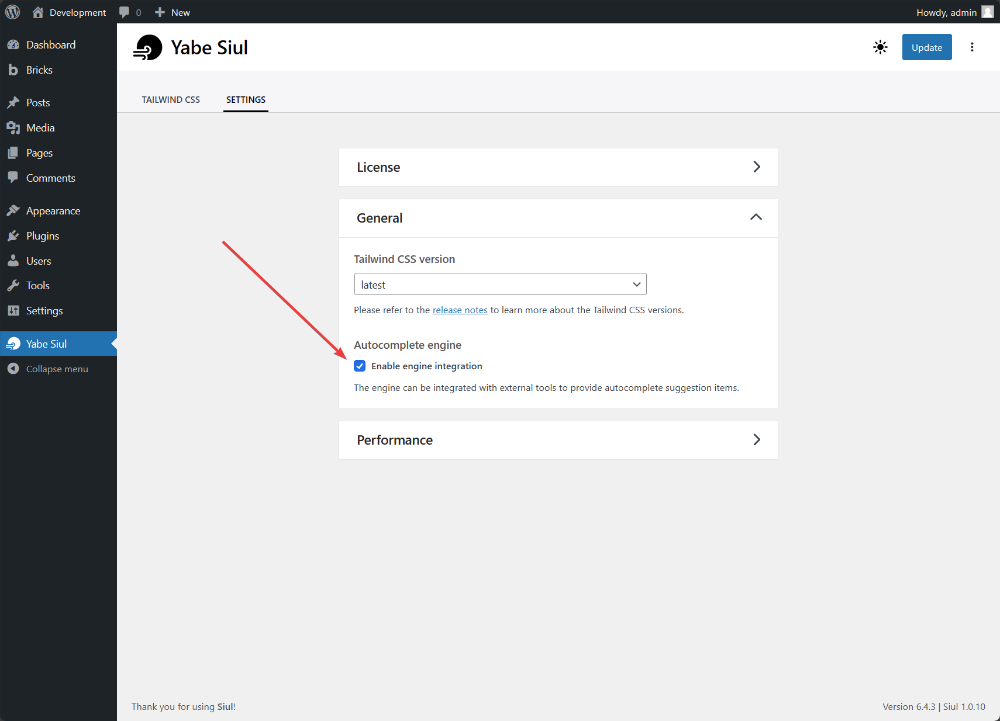
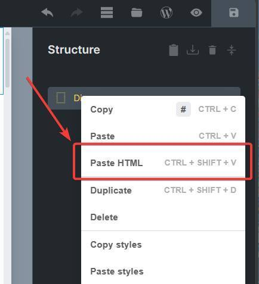

[Bricks](https://bricksbuilder.io/) is a visual site builder for WordPress. Bricks allow you to build a beautiful site with unmatched performance, design, and customizability.

## Using Tailwind CSS in Bricks

The Yabe Siul first-class integration with Bricks allows you to use Tailwind CSS directly in Bricks editor.

Start type the Tailwind's class name in the Bricks editor, and the element on the canvas will be styled accordingly.

### Bricksbender

Yabe Siul is platform-agnostic. To ensure the development flexibility, we have seperated some Bricks specific features into a separate plugin called **Yabe Bricksbender**. This plugin is free and open-source. Visit https://bricksbender.yabe.land for more information.

### Plain Classes

Plain Classes is a field in the Bricks editor that allows you to add custom classes to Bricks elements without adding the class to the Global Class database.

To enable the Plain Classes feature, you need to install the [**Yabe Bricksbender**](#bricksbender) plugin.

Once installed, you will see the `⚡` icon on the element panel.

### Autocomplete class names

The Tailwind CSS cheat sheet is right on your visual builder editor. This makes it easy to use Tailwind CSS in Bricks.

As you type on the [Plain Classes](#plain-classes) field, Tailwind class names will be suggested automatically. You can use the arrow keys to navigate through the suggestions and press Enter to select the class name.

To enable the Tailwind CSS autocomplete feature, you need to install the [**Yabe Bricksbender**](#bricksbender) plugin.

Once installed, you can go to `Yabe Siul → Settings` and open the `General` panel. Then, tick the `Enable engine integration` checkbox.

### HTML to Bricks

Tailwind CSS has tons of ready-made components and templates. You can copy the HTML code and paste it into the Bricks editor.

The HTML code will be converted to Bricks elements automatically. The Tailwind CSS classes will be imported to the [Plain Classes](#plain-classes) field.

To enable the HTML to Bricks feature, you need to install the [**Yabe Bricksbender**](#bricksbender) plugin.

Once installed, you will see the `Paste HTML` menu on the Context Menu panel.

