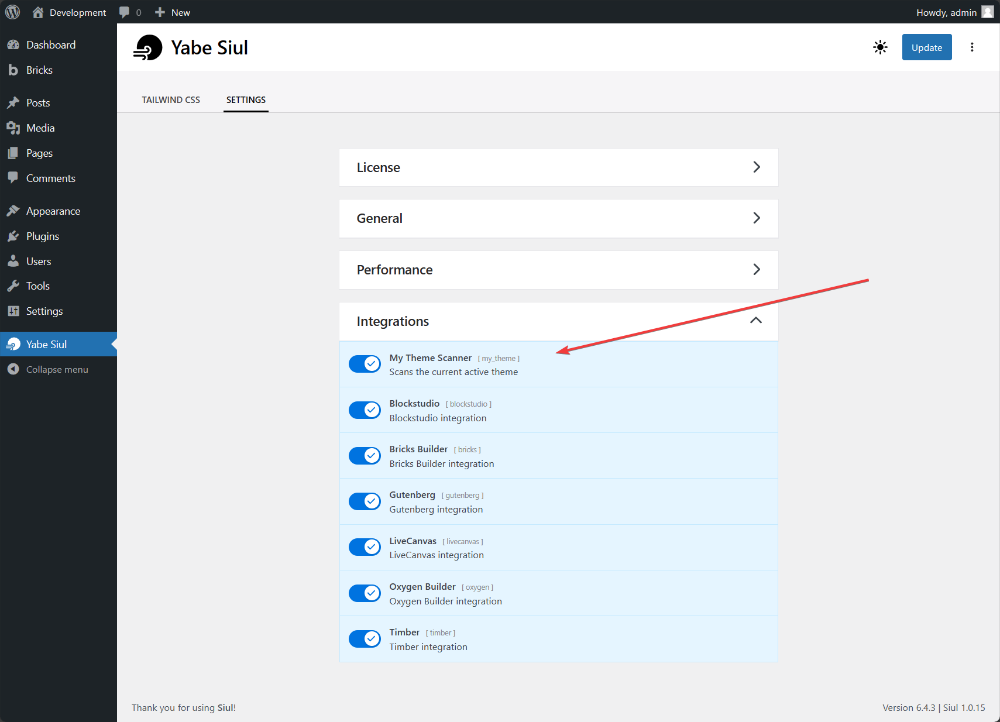

Yabe Siul is developer friendly. You can easily integrate Yabe Siul into your theme or plugin with the available function and WordPress hooks.

## Using Play CDN

:::caution[Note]
The Play CDN is designed for development purposes only. Please use the cached CSS file in production.
:::

During development, Yabe Siul uses the Play CDN to dynamically create the required styles. As the Tailwind JIT engine is loaded, it will reactively create the required styles for the design on-the-fly.

In the front end or editor's canvas view, you may want to load the Play CDN. This is the recommended approach for the best development experience.

The Play CDN consists of two parts:
- The [`importmap`](https://developer.mozilla.org/en-US/docs/Web/HTML/Element/script/type/importmap)
- The Play CDN (the Tailwind JIT engine, `main.css`, and `preset.js`)

Both must be loaded in respective order.

### Importmap

:::note
The `importmap` must be loaded earlier on the `head` of the HTML document.
:::

The `importmap` is a JSON file that maps the package names to the URLs of the JavaScript modules that define them. It is used to load the minimum required JavaScript modules that will be used by the Tailwind JIT engine and the `preset.js`.

```php
<?php

/**
 * @param bool $display Default is `true`. Whether to echo the importmat or return it as a string.
 * @return void|string The importmap as a string if $display is false.
 */
\Yabe\Siul\Core\Runtime::get_instance()->enqueue_importmap(/** $display */);
```

### Play CDN

The Play CDN comprises the Tailwind JIT engine, `main.css`, and `preset.js`.

```php
<?php

/**
 * @param bool $display Default is `true`. Whether to echo the Play CDN or return it as a string. 
 * @return void|string
 */
\Yabe\Siul\Core\Runtime::get_instance()->enqueue_play_cdn(/** $display */);
```

## Cached CSS

:::caution[Note]
The cached CSS is designed for production purposes only. Please use the Play CDN in development.
:::

In [production](../../common/production), Yabe Siul uses the cached CSS file for the best performance.

In the front end, you may want to load the cached CSS file. This is the recommended approach for the best performance as the cached CSS file is pre-generated by scanning the designs.

Check if the cached CSS file exists.

```php
<?php

/**
 * @return bool Whether the cached CSS file exists.
 */
\Yabe\Siul\Core\Runtime::get_instance()->is_cache_exists();
```

Get the URL of the cached CSS file.

```php
<?php

/**
 * @return string The URL of the cached CSS file
 */
\Yabe\Siul\Core\Cache::get_cache_url(\Yabe\Siul\Core\Cache::CSS_CACHE_FILE);
```

Get the path of the cached CSS file.

```php
<?php

/**
 * @return string The path to the cached CSS file
 */
\Yabe\Siul\Core\Cache::get_cache_path(\Yabe\Siul\Core\Cache::CSS_CACHE_FILE);
```

## Default behavior

Yabe Siul by default will load the [Play CDN](#using-play-cdn) or the [cached CSS file](#cached-css) in the front end via the `wp_head` hook.

If your theme has used the `wp_head` hook, it may benefit from this default behavior.

To disable the default behavior, you can use the several available filters hooks to control the behavior.

### Entirely turn off the default behavior

To prevent the Play CDN, cached CSS file, and Autocomplete engine from loading in the front end, you can use the `f!yabe/siul/core/runtime:is_prevent_load` filter hook.

```php
<?php

/**
 * @param bool $is_prevent_load
 */
add_filter('f!yabe/siul/core/runtime:is_prevent_load', true);
```

### Exclude cached CSS or force Play CDN for specific user

To exclude the cached CSS file from loading in the front end for specific user or to force the Play CDN to load, you can use the `f!yabe/siul/core/runtime:append_header.exclude_admin` filter hook.

```php
<?php

/**
 * @param bool $is_exclude_admin Set to `true` to always use the Play CDN instead of cached CSS file
 */
add_filter('f!yabe/siul/core/runtime:append_header.exclude_admin', true);
```

## Autocomplete engine

Yabe Siul has Autocomplete engine built-in. It can be used to generate suggestions for Tailwind CSS class names on-the-fly.

If the [default behavior](#default-behavior) is not disabled and the `Enable engine integration` setting are enabled by the user, the Autocomplete engine will be loaded along with the [Play CDN](#using-play-cdn) in the front end via the `wp_head` hook.

### Manually load the Autocomplete engine

:::caution[Note]
The Play CDN must be loaded before the Autocomplete engine.
:::

To load the Autocomplete engine, you can get the module data and use it to prepare the Autocomplete engine running on your environment.

```php
/**
 * @var array $prepared_module
 */
$prepared_module = \Yabe\Siul\Core\Runtime::get_instance()->prepare_module_autocomplete();
```

The returned `$prepared_module` is an array that contains the module data which can be used to load the assets. The `$prepared_module` variable contains the following data:

```php
[
    'dependencies' => ['wp-hooks'], // list of dependencies
    'assets' => [
        'js' => [
            '...',
            // relative path of the js files
        ],
        'css' => [
            '...',
            // relative path of the css files
        ],
    ],
    'data' => [
        '_version' => '1.0.0', // version of the Yabe Siul plugin
        'assets' => [
            'url' => 'http://example.com/wp-content/plugins/yabe-siul/build/', // url of the assets folder
        ],
        'tailwind' => [
            'version' => '3.0.0', // tailwind version used
        ],
    ],
];
```

### Using the Autocomplete engine suggestions

If the global `wp.hooks` object is available, you can query the Autocomplete engine suggestions using the filter hook.

```js
/**
 * @type {string} query The query to search for
 */
const query = 'bg-';

/**
 * @type {Promise<{name: string, color: string | null, isVariant: boolean, variants: any[], important: boolean}[]>} suggestions The suggestions with the given query.
 */
const suggestions = await window.wp.hooks.applyFilters('siul.module.autocomplete', query);
```

If the Autocomplete engine is manually loaded, you can use the `siul.module.autocomplete.query` object to query the suggestions.

```js
/**
 * @type {string} query The query to search for
 */
const query = 'bg-';

/**
 * @type {Promise<{name: string, color: string | null, isVariant: boolean, variants: any[], important: boolean}[]>} suggestions The suggestions with the given query.
 */
const suggestions = await siul.module.autocomplete.query(query);
```

## Main.CSS

If you want to prepend or append the `main.css` file, you can use the available filter hooks. The appended content will not be loaded to the code editor in the plugin's settings page. It will only be loaded in the front end, editor's canvas view, or Compile engine.

```php
<?php

add_filter('f!yabe/siul/core/runtime:enqueue_play_cdn.css.prepend', function (string $prepend) {
    return $prepend . '/* Your custom prepend */';
});

add_filter('f!yabe/siul/core/runtime:enqueue_play_cdn.css.append', function (string $append) {
    return $append . '/* Your custom append */';
});
```

## tailwind.config.js

If you want to prepend or append the `tailwind.config.js` file, you can use the available filter hooks.

```php
<?php

add_filter('f!yabe/siul/core/runtime:enqueue_play_cdn.config.prepend', function (string $prepend) {
    return $prepend . '/* Your custom prepend */';
});

add_filter('f!yabe/siul/core/runtime:enqueue_play_cdn.config.append', function (string $append) {
    return $append . '/* Your custom append */';
});
```

## Compiler's scanners

During the cached CSS generation process, the Compiler scans the designs and generates the required styles. The design payload can be an HTML string, a JSON string, or a PHP array/object.

The Compiler's scanners are composed of several `Provider`. Each `Provider` is responsible for scanning the design payload and feeding the Compiler with the design payload.

Each registered `Provider` will be listed in the plugin's settings page. The user can enable or disable the `Provider` from the settings page.



### Registering a Provider

To register a `Provider`, you can use the `'f!yabe/siul/core/cache:compile.providers'` filter hook.

```php
<?php

/**
 * @param array $providers The collection of providers that will be used to scan the design payload
 * @return array 
 */
function register_my_theme_provider(array $providers): array {
    $providers[] = [
        'id' => 'my_theme',
        'name' => 'My Theme Scanner',
        'description' => 'Scans the current active theme',
        'callback' => 'scanner_my_theme_provider', // The function that will be called to get the data
        'enabled' => \Yabe\Siul\Utils\Config::get(sprintf(
            'integration.%s.enabled',
            'my_theme' // The id of this custom provider
        ), true),
    ];

    return $providers;
}

add_filter('f!yabe/siul/core/cache:compile.providers', 'register_my_theme_provider');
```

### The Provider's callback

The `callback` key is the callable function that will be called to get the data. It can be a function name, a closure, or an array of class and method name. 

The `callback` function must return the design payload as an array of `[ 'name' => '...', 'content' => '...' ]`.

```php
<?php

function scanner_my_theme_provider(): array {
    return [
        [
            'name' => 'Foo Template', // The name of the data
            'content' => '<footer class="p-10 bg-blue-100">My custom foo</footer>', // The content of the data as an HTML string
        ],
        [
            'name' => 'Bar Template', // The name of the data
            'content' => [] // The content of the data as an array or object
        ],
        // ...
    ];
}
```