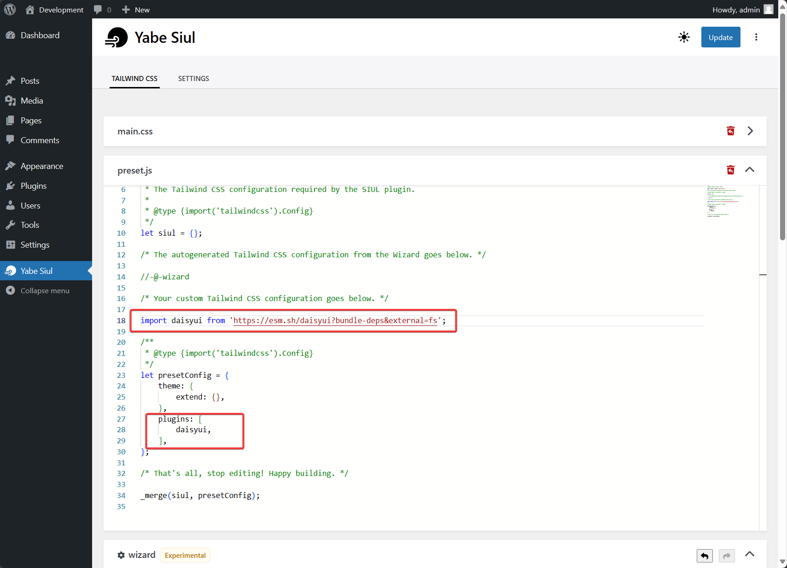
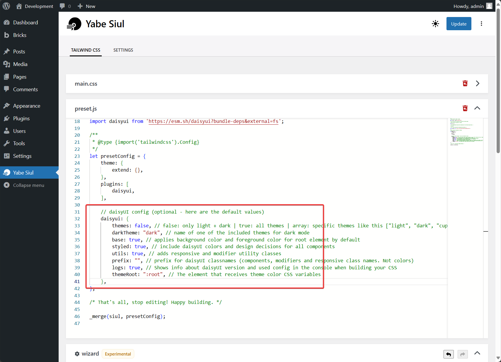

[daisyUI](https://daisyui.com/) is "the most popular, free and open-source component library for Tailwind CSS" and adds all common UI components class names to Tailwind CSS so you can make beautiful websites faster than ever.

This guide will show you how to use daisyUI on WordPress websites using Yabe Siul.

## Step 1: Open the Preset.JS panel

Go to `Yabe Siul → Tailwind CSS` and open the `preset.js` panel.


## Step 2: Add the daisyUI package as a Tailwind CSS plugin

Import the `daisyui` package and add it to the `presetConfig.plugins` array.

```javascript {1, 11}
import daisyui from 'https://esm.sh/daisyui?bundle-deps&external=fs';

/**
 * @type {import('tailwindcss').Config} 
 */
let presetConfig = {
    theme: {
        extend: {},
    },
    plugins: [
        daisyui,
    ],
};
```



## Step 3: Configure the daisyUI plugin (optional)

You can configure the daisyUI plugin by adding a `daisyui` object to the `presetConfig` object.



Please refer to the [daisyUI documentation](https://daisyui.com/docs/config/) for more information on how to configure the daisyUI plugin.

## Step 4: Save the changes

Save the changes and you are ready to use daisyUI on your WordPress website.

