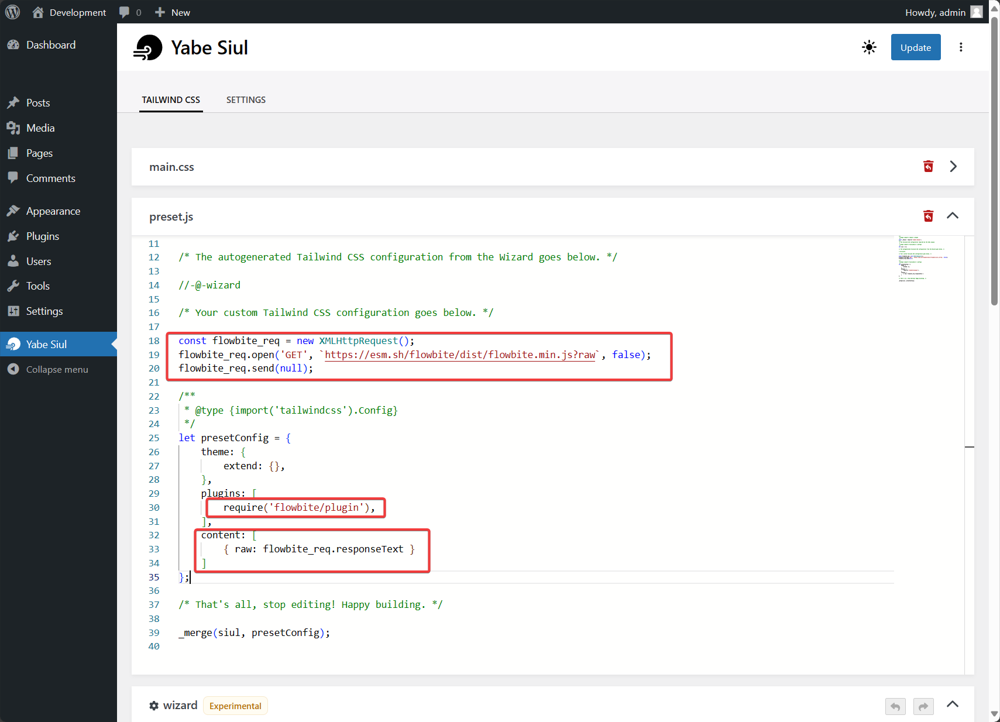

[Flowbite](https://flowbite.com/) is an open-source library of over 600+ UI components, sections, and pages based on the utility-first Tailwind CSS framework featuring dark mode support, a Figma design system, templates, and more.

In this guide, we will show you how to use Flowbite on WordPress websites using Yabe Siul.

## Step 1: Open the Preset.JS panel

Go to `Yabe Siul → Tailwind CSS` and open the `preset.js` panel.


## Step 2: Add the Flowbite package as a Tailwind CSS plugin

Add `flowbite/plugin` package to the `presetConfig.plugins` array and include the Flowbite JavaScript file as a raw content in the `presetConfig.content` array.

```javascript {1-3, 13, 16}
const flowbite_req = new XMLHttpRequest();
flowbite_req.open('GET', `https://esm.sh/flowbite/dist/flowbite.min.js?raw`, false);
flowbite_req.send(null);

/**
 * @type {import('tailwindcss').Config} 
 */
let presetConfig = {
    theme: {
        extend: {},
    },
    plugins: [
        require('flowbite/plugin'),
    ],
    content: [
        { raw: flowbite_req.responseText }
    ]
};
```



## Step 3: Save the changes

Save the changes and you are ready to use Flowbite on your WordPress website.

## Step 4: Use the Flowbite interactive elements (optional)

Flowbite comes with a set of interactive elements like modals, dropdowns, and more. To use these elements, you need to add the Flowbite JavaScript file to your WordPress website.

Add the following code to your theme's `functions.php` file or a [Snippet plugin](https://wordpress.org/plugins/search/Snippet/).

```php
<?php

add_action('wp_enqueue_scripts', function () {
    wp_enqueue_script('flowbite', 'https://esm.sh/flowbite/dist/flowbite.min.js?raw');
});
```