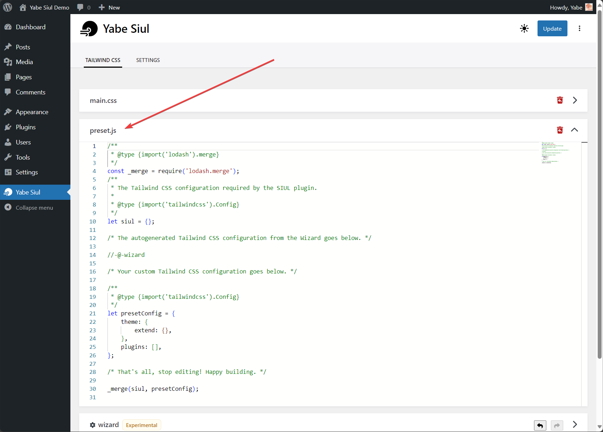
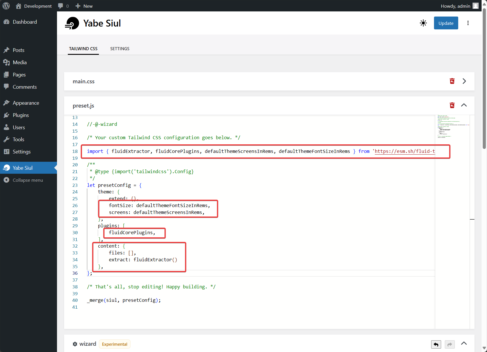

[fluid-tailwind](https://fluid.tw/) is a **fluid** `clamp()` plugin for Tailwind that works with every utility, allowing you to create smoother responsive styles in fewer classes.

**Features**
- Supports all core plugins out of the box (i.e. font size, margin, padding, width, etc.)
- Fewer classes than breakpoints (i.e. pt-4 md:p-8 lg:pt-10)
- Ensures all fluid text meets accessibility requirements
- etc.

In this guide, we will show you how to use fluid-tailwind on WordPress websites using Yabe Siul.

## Step 1: Open the Preset.JS panel

Go to `Yabe Siul → Tailwind CSS` and open the `preset.js` panel.



## Step 2: Add the fluid-tailwind package as a Tailwind CSS plugin

Import the `fluidCorePlugins` from the `fluid-tailwind` package and add it to the `presetConfig.plugins` array.
Then add the `fluidExtractor` to the `presetConfig.content.extract` property.

To use the default theme screens and font sizes, you can import the `defaultThemeScreensInRems` and `defaultThemeFontSizeInRems` from the `fluid-tailwind` package and use them in the `presetConfig.theme.screens` and `presetConfig.theme.fontSize` properties.


```javascript {1, 9-10, 13, 15-18}
import { fluidExtractor, fluidCorePlugins, defaultThemeScreensInRems, defaultThemeFontSizeInRems } from 'https://esm.sh/fluid-tailwind@0.1.6?bundle-deps&external=fs';

/**
 * @type {import('tailwindcss').Config} 
 */
let presetConfig = {
    theme: {
        extend: {},
        fontSize: defaultThemeFontSizeInRems,
        screens: defaultThemeScreensInRems,
    },
    plugins: [
        fluidCorePlugins,
    ],
    content: {
        files: [],
        extract: fluidExtractor()
    },
};
```



## Step 3: Save the changes

Save the changes and you are ready to use fluid-tailwind on your WordPress website.


Please refer to the [fluid-tailwind documentation](https://fluid.tw/#basic-usage) for more information on how to using the fluid-tailwind or configuring it further.
